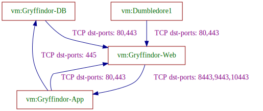

# vmware-analyzer

## About vmware-analyzer
This repo contains packages and a CLI for NSX DFW analysis and k8s network policy synthesis.
It includes analysis of the network connectivity between VMs, as specified by various NSX resources.
It also includes functionality to synthesize k8s network policies, that preserve the micro-segmentation configured by NSX DFW.


## Usage
Run the `nsxanalyzer` CLI tool.

```
$ ./bin/nsxanalyzer -h

nsxanalyzer is a CLI for collecting NSX resources, analysis of permitted connectivity between VMs,
and generation of k8s network policies. It uses REST API calls from NSX manager.

Usage:
  nsxanalyzer [command]

Available Commands:
  analyze     Analyze NSX connectivity from NSX DFW configuration
  collect     Collect NSX configuration from given NSX URL
  completion  Generate the autocompletion script for the specified shell
  generate    Generate OCP-Virt micro-segmentation resources from input NSX config
  help        Help about any command
  lint        Lint input NSX config - show potential DFW redundant rules

Flags:
      --color                          flag to enable color output (default false)
      --disable-insecure-skip-verify   flag to disable NSX connection retry with insecureSkipVerify (default false).Alternatively, set the NSX_DISABLE_SKIP_VERIFY environment variable to true
  -h, --help                           help for nsxanalyzer
      --host string                    NSX host URL. Alternatively, set the host via the NSX_HOST environment variable
      --log-file string                file path to write nsxanalyzer log
      --log-level string               flag to set log level; must by one of: fatal,error,warn,info,debug,debug2 (default "fatal")
      --password string                NSX password. Alternatively, set the password via the NSX_PASSWORD environment variable
  -q, --quiet                          flag to run quietly, report only severe errors and result (default false)
      --resource-dump-file string      file path to store collected resources in JSON format
  -r, --resource-input-file string     file path input JSON of NSX resources (instead of collecting from NSX host)
      --username string                NSX username. Alternatively, set the username via the NSX_USER environment variable
  -v, --verbose                        flag to run with more informative messages printed to log (default false)
      --version                        version for nsxanalyzer

Use "nsxanalyzer [command] --help" for more information about a command.
```

## `collect` command
```
$ ./bin/nsxanalyzer collect -h

Collect NSX configuration from given NSX URL

Usage:
  nsxanalyzer collect [flags]

Aliases:
  collect, export

Examples:
  # Collect NSX configuration and store as JSON file
        nsxanalyzer collect -f config.json

Flags:
      --anonymize   flag to anonymize collected NSX resources (default false)
```

## `analyze` command

```
$ ./bin/nsxanalyzer analyze -h
Analyze NSX connectivity from NSX DFW configuration

Usage:
  nsxanalyzer analyze [flags]

Examples:
  # Analyze NSX configuration
        nsxanalyzer analyze -r config.json

Flags:
  -e, --explain                     flag to explain connectivity output with rules explanations per allowed/denied connections (default false)
  -f, --filename string             file path to store analysis results
  -h, --help                        help for analyze
  -o, --output string               output format; must be one of txt,dot,json,svg (default "txt")
      --output-filter strings       filter the analysis/synthesis results by vm names, can specify more than one (example: "vm1,vm2")
      --topology-dump-file string   file path to store topology

```

## Example connectivity analysis output

### Textual permitted connectivity
```
$ nsxanalyzer analyze -r pkg/data/json/Example2.json 

Analyzed connectivity:
Source         |Destination    |Permitted connections
Dumbledore1    |Gryffindor-Web |TCP dst-ports: 80,443
Dumbledore1    |Hufflepuff-Web |TCP dst-ports: 80,443
Dumbledore1    |Slytherin-Web  |TCP dst-ports: 80,443
Dumbledore2    |Gryffindor-Web |TCP dst-ports: 80,443
Dumbledore2    |Hufflepuff-Web |TCP dst-ports: 80,443
Dumbledore2    |Slytherin-Web  |TCP dst-ports: 80,443
Gryffindor-App |Gryffindor-DB  |TCP dst-ports: 445
Gryffindor-App |Gryffindor-Web |TCP dst-ports: 80,443
Gryffindor-App |Hufflepuff-App |All Connections
Gryffindor-App |Hufflepuff-Web |TCP dst-ports: 80,443
Gryffindor-App |Slytherin-Web  |TCP dst-ports: 80,443
...

```

### Visualized permitted connectivity

To provide visualized permitted connectivity diagram, `graphviz` should be installed.

```
$ nsxanalyzer analyze -r pkg/data/json/Example2.json --output-filter Gryffindor-App,Gryffindor-DB,Gryffindor-Web,Dumbledore1 -o svg -f ex2Filter1.svg
```



## `generate` command

```
$ ./bin/nsxanalyzer generate -h
Generate OCP-Virt micro-segmentation resources from input NSX config

Usage:
  nsxanalyzer generate [flags]

Aliases:
  generate, synthesize

Examples:
  # Generate OCP-Virt netpol resources
        nsxanalyzer generate -r config.json

Flags:
      --create-dns-policy                  flag to create a policy allowing access to target env dns pod (default false)
      --disjoint-hint stringArray          comma separated list of NSX groups/tags that are always disjoint in their VM members, needed for an effective and sound synthesis process, can specify more than one hint (example: "--disjoint-hint frontend,backend --disjoint-hint app,web,db")
      --endpoints-mapping string           flag to set target endpoints for synthesis;  must be one of vms,pods,both (default "both")
  -h, --help                               help for generate
      --hints-inference                    automatic inference of NSX groups/tags that are always disjoint, needed for an effective and sound synthesis process
      --output-filter strings              filter the analysis/synthesis results by vm names, can specify more than one (example: "vm1,vm2")
      --policy-optimization-level string   flag to set policy optimization level; must by one of: none,moderate,max (default "max")
      --segments-mapping string            flag to set target mapping from segments; must be one of pod-network,udns (default "udns")
  -d, --synthesis-dir string               run synthesis; specify directory path to store target synthesis resources
      --synthesize-admin-policies          include admin network policies in policy synthesis (default false)
```

## Example k8s network policy synthesis

Original NSX DFW config: (see `pkg/data/json/Example1.json`)
```
ruleID |ruleName           |src      |dst     |conn |action |direction |scope |sec-policy |Category
1004   |allow_smb_incoming |frontend |backend |SMB  |allow  |IN_OUT    |ANY   |app-x      |Application
1003   |default-deny-rule  |ANY      |ANY     |ANY  |deny   |IN_OUT    |ANY   |app-x      |Application
```

Run policy synthesis:

```
$ nsxanalyzer generate  -r pkg/data/json/Example1.json -d ex1-synth/
```

Example policy generated (1 out of 3): (see `ex1-synth/k8s_resources/policies.yaml` )

```
apiVersion: networking.k8s.io/v1
kind: NetworkPolicy
metadata:
    annotations:
        description: 'TCP dst-ports: 445 from (group = frontend) to (group = backend)'
        nsx-id: "1004"
    creationTimestamp: null
    name: policy_0
spec:
    egress:
        - ports:
            - port: 445
              protocol: TCP
          to:
            - podSelector:
                matchExpressions:
                    - key: group__backend
                      operator: Exists
    podSelector:
        matchExpressions:
            - key: group__frontend
              operator: Exists
    policyTypes:
        - Egress
```

More details [here](docs/synthesis.md).


## `lint` command

```
$ ./bin/nsxanalyzer lint -h
Lint input NSX config - show potential DFW redundant rules

Usage:
  nsxanalyzer lint [flags]

Examples:
  # Lint NSX DFW
        nsxanalyzer lint -r config.json

Flags:
  -h, --help   help for lint
```

### Example DFW redundant rules analysis

For the following sample DFW configuration:
```
DFW:
original rules:
ruleID |ruleName  |src      |dst     |services |action |direction |scope |sec-policy  |Category
1      |allowRule |frontend |backend |SMB      |allow  |IN_OUT    |ANY   |Application |Application
2      |allowRule |frontend |backend |HTTP     |allow  |IN_OUT    |ANY   |Application |Application
3      |allowRule |backend  |system  |HTTPS    |allow  |IN_OUT    |ANY   |Application |Application
4      |allowRule |frontend |backend |HTTP,SMB |allow  |IN_OUT    |ANY   |Application |Application
5      |denyRule  |ANY      |ANY     |ANY      |deny   |IN_OUT    |ANY   |Application |Application
```

The lint report identifies rules `3` and `4` as redundant:

```
$ nsxanalyzer lint -r pkg/data/json/one_redundant_covered_by_2_rules.json
INFO        Lint NSX config - produce redundant DFW rules report:

Potential shadowed DFW rule ID |DFW Category |Direction |Shadowing rules IDs
4                              |Application  |IN_OUT    |[1 2]


Ineffective DFW rule ID |Description
3                       |empty dest


```

## NSX Supported API versions and resources
See documentation [here](docs/nsx_support.md).

## Build the project

Make sure you have golang 1.24+ on your platform

```commandline
git clone git@github.com:np-guard/vmware-analyzer.git
cd vmware-analyzer
make mod 
make build
```

Test your build by running `./bin/nsxanalyzer -h`.


## Build analyzer image

Use the following to build a docker image:

```commandline
make nsx-analyzer-image
```

Test your image build by running `docker run nsx-analyzer:latest -h`.

### Image build configuration

| Name              | Default value | Description |
| :---------------- | :-----------  | :---------- |
| IMAGE_REGISTRY    |   docker.io   | The registry address to which the images should be pushed. |
| NSX_ANALYZER_TAG  |   latest      | The image tag for nsx-analyzer image build. |
| NSX_ANALYZER_IMAGE|   nsx-analyzer| The image name for nsx-analyzer image build. |
