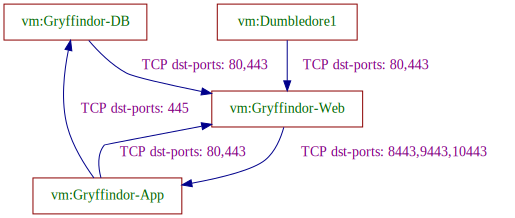

# vmware-analyzer

## About vmware-analyzer
This repo contains packages and a CLI for analyzing the network connectivity between VMs, as specified by various NSX resources.

## Usage
Run the `nsxanalyzer` CLI tool.

```
$ ./bin/nsxanalyzer -h
nsxanalyzer is a CLI for collecting NSX resources, and analyzing permitted connectivity between VMs.
It uses REST API calls from NSX manager.

Usage:
  nsxanalyzer [flags]

Flags:
  -f, --filename string              file path to store analysis results
  -h, --help                         help for nsxanalyzer
      --host string                  nsx host url
  -o, --output string                output format; must be one of [txt, dot, json, svg] (default "txt")
      --output-filter strings        filter the analysis results, can have more than one
      --password string              nsx password
  -q, --quiet                        runs quietly, reports only severe errors and results
      --resource-dump-file string    file path to store collected resources in JSON format
      --resource-input-file string   file path input JSON of NSX resources
      --skip-analysis                flag to skip analysis, run only collector
      --topology-dump-file string    file path to store topology
      --username string              nsx username
  -v, --verbose                      runs with more informative messages printed to log
```

## Example connectivity analysis output

### Textual permitted connectivity
```
$ nsxanalyzer --resource-input-file pkg/collector/data/json/Example2.json 

analyzed connectivity:
Dumbledore1 => Gryffindor-Web: TCP dst-ports: 80,443
Dumbledore1 => Hufflepuff-Web: TCP dst-ports: 80,443
Dumbledore1 => Slytherin-Web: TCP dst-ports: 80,443
Dumbledore2 => Gryffindor-Web: TCP dst-ports: 80,443
Dumbledore2 => Hufflepuff-Web: TCP dst-ports: 80,443
Dumbledore2 => Slytherin-Web: TCP dst-ports: 80,443
Gryffindor-App => Gryffindor-DB: TCP dst-ports: 445
Gryffindor-App => Gryffindor-Web: TCP dst-ports: 80,443
Gryffindor-App => Hufflepuff-App: All Connections
Gryffindor-App => Hufflepuff-Web: TCP dst-ports: 80,443
...

```

### Visualized permitted connectivity
```
$ nsxanalyzer --resource-input-file pkg/collector/data/json/Example2.json --output-filter Gryffindor-App,Gryffindor-DB,Gryffindor-Web,Dumbledore1 -o svg -f ex2Filter1.svg

```


## Build the project

Make sure you have golang 1.23+ on your platform

```commandline
git clone git@github.com:np-guard/vmware-analyzer.git
cd vmware-analyzer
make mod 
make build
```

Test your build by running `./bin/vpcanalyzer -h`.