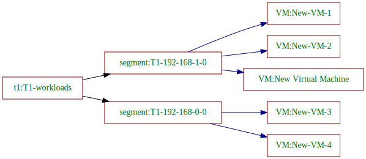
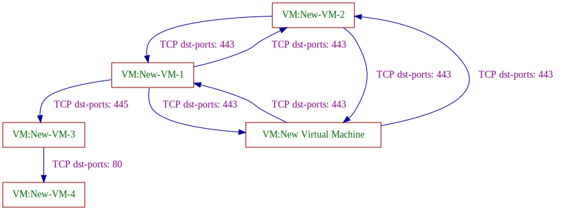
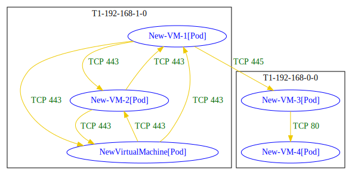
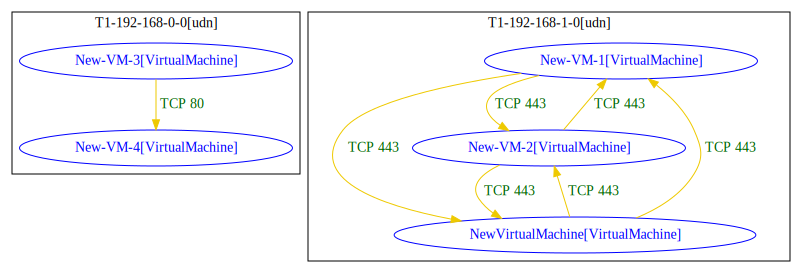
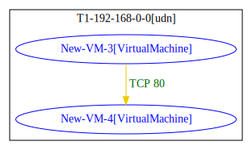

## Migration example

This section details simple walkthrough for micro-segmentation migration automaion from NSX to OCP-Virt with `nsxanalyzer`.

### Source: NSX 

Following segments connected by T1-Gateway:
```
Segments:
Type |overlay/vlan |Segment Name   |Segment ID     |Segment CIDRs  |VLAN IDs |VMs
     |overlay      |T1-192-168-0-0 |T1-192-168-0-0 |192.168.0.0/24 |         |New-VM-3,New-VM-4
     |overlay      |T1-192-168-1-0 |T1-192-168-1-0 |192.168.1.0/24 |         |New-VM-1,New-VM-2,New Virtual Machine
```

```
VMs:
VM Name             |VM ID               |VM Addresses
New Virtual Machine |New Virtual Machine |192.168.1.2
New-VM-1            |New-VM-1            |192.168.1.1
New-VM-2            |New-VM-2            |192.168.1.3
New-VM-3            |New-VM-3            |192.168.0.1
New-VM-4            |New-VM-4            |192.168.0.2
```

Analyzed topology graph:

```
$ nsxanalyzer analyze -r pkg/data/json/ExampleAppWithGroupsAndSegments.json -o svg --topology-dump-file topology.svg
```




Micro-segmentation of NSX details:

```
Group Name           |VMs
bar-app              |New-VM-1, New-VM-2, New Virtual Machine
foo-app              |New-VM-3, New-VM-4
foo-backend          |New-VM-4
foo-frontend         |New-VM-3
research-app         |New-VM-1, New-VM-2, New-VM-3, New-VM-4, New Virtual Machine
research-test-expr-2 |New-VM-1
```

```
DFW:
original rules:
ruleID |ruleName                  |src                  |dst          |services |action |direction |scope |sec-policy             |Category
1027   |foo-allow-http-to-backend |foo-frontend         |foo-backend  |HTTP     |allow  |IN_OUT    |ANY   |foo-app                |Application
1028   |default-deny-foo-app      |foo-app              |foo-app      |ANY      |deny   |IN_OUT    |ANY   |foo-app                |Application
1025   |allow-smb-to-foo-frontend |research-test-expr-2 |foo-frontend |SMB      |allow  |IN_OUT    |ANY   |New Policy             |Application
1024   |allow-bar-app-https       |bar-app              |bar-app      |HTTPS    |allow  |IN_OUT    |ANY   |New Policy             |Application
1021   |deny-research-app         |research-app         |research-app |ANY      |deny   |IN_OUT    |ANY   |Default Layer3 Section |Application
2      |default-deny-rule         |ANY                  |ANY          |ANY      |deny   |IN_OUT    |ANY   |Default Layer3 Section |Application
```

Analyzed connectivity:
```
$ nsxanalyzer analyze -r pkg/data/json/ExampleAppWithGroupsAndSegments.json

Analyzed connectivity:
Source              |Destination         |Permitted connections
New Virtual Machine |New-VM-1            |TCP dst-ports: 443
New Virtual Machine |New-VM-2            |TCP dst-ports: 443
New-VM-1            |New Virtual Machine |TCP dst-ports: 443
New-VM-1            |New-VM-2            |TCP dst-ports: 443
New-VM-1            |New-VM-3            |TCP dst-ports: 445
New-VM-2            |New Virtual Machine |TCP dst-ports: 443
New-VM-2            |New-VM-1            |TCP dst-ports: 443
New-VM-3            |New-VM-4            |TCP dst-ports: 80
```

Visualization of analyzed connectivity:
```
$ nsxanalyzer analyze -r pkg/data/json/ExampleAppWithGroupsAndSegments.json -o svg -f graph.svg
```




### Target: OCP-Virt 

Migration with `generate` command options:

Segments to namespace mapping: 
* segment to namespace in pod-network
* segment to namespace in UDN 

Endpoints options:
* VMs 
* Pods instead of VMs 


Example result for migration to Pods in "segment to namespace in pod-network" mapping:

```
$ nsxanalyzer generate -r pkg/data/json/ExampleAppWithGroupsAndSegments.json -v --endpoints-mapping pods --segments-mapping pod-network -d example1/
```

Generated YAML files [here](./generated_manifests_1/k8s_resources/).

Now, let's analyze OCP-Virt connectivity of generated resources, with [`netpol-analyzer`](https://github.com/np-guard/netpol-analyzer).

```

$ netpol-analyzer list --dirpath example1/

T1-192-168-0-0/New-VM-3[Pod] => T1-192-168-0-0/New-VM-4[Pod] : TCP 80
T1-192-168-1-0/New-VM-1[Pod] => T1-192-168-0-0/New-VM-3[Pod] : TCP 445
T1-192-168-1-0/New-VM-1[Pod] => T1-192-168-1-0/New-VM-2[Pod] : TCP 443
T1-192-168-1-0/New-VM-1[Pod] => T1-192-168-1-0/NewVirtualMachine[Pod] : TCP 443
T1-192-168-1-0/New-VM-2[Pod] => T1-192-168-1-0/New-VM-1[Pod] : TCP 443
T1-192-168-1-0/New-VM-2[Pod] => T1-192-168-1-0/NewVirtualMachine[Pod] : TCP 443
T1-192-168-1-0/NewVirtualMachine[Pod] => T1-192-168-1-0/New-VM-1[Pod] : TCP 443
T1-192-168-1-0/NewVirtualMachine[Pod] => T1-192-168-1-0/New-VM-2[Pod] : TCP 443
```



Example result for migration to VMs in "segment to namespace in UDN" mapping:

```
$ nsxanalyzer generate -r pkg/data/json/ExampleAppWithGroupsAndSegments.json -v --endpoints-mapping vms --segments-mapping udns -d example2/
```

Note that this time, connectivity cross NSX segments is not preserved in target (cross UDNs), due to UDNs isolation. 

Generated YAML files [here](./generated_manifests_2/k8s_resources/).

```
$ netpol-analyzer list --dirpath example2/

T1-192-168-0-0[udn]:
T1-192-168-0-0[udn]/New-VM-3[VirtualMachine] => T1-192-168-0-0[udn]/New-VM-4[VirtualMachine] : TCP 80

T1-192-168-1-0[udn]:
T1-192-168-1-0[udn]/New-VM-1[VirtualMachine] => T1-192-168-1-0[udn]/New-VM-2[VirtualMachine] : TCP 443
T1-192-168-1-0[udn]/New-VM-1[VirtualMachine] => T1-192-168-1-0[udn]/NewVirtualMachine[VirtualMachine] : TCP 443
T1-192-168-1-0[udn]/New-VM-2[VirtualMachine] => T1-192-168-1-0[udn]/New-VM-1[VirtualMachine] : TCP 443
T1-192-168-1-0[udn]/New-VM-2[VirtualMachine] => T1-192-168-1-0[udn]/NewVirtualMachine[VirtualMachine] : TCP 443
T1-192-168-1-0[udn]/NewVirtualMachine[VirtualMachine] => T1-192-168-1-0[udn]/New-VM-1[VirtualMachine] : TCP 443
T1-192-168-1-0[udn]/NewVirtualMachine[VirtualMachine] => T1-192-168-1-0[udn]/New-VM-2[VirtualMachine] : TCP 443

```




### Partial migration option - example

The flag `--output-filter` allows specifying VMs names to focus on for the `generate` command. 
It will consider onlt NSX resources relevant for these VMs, and will generate policies from these resources only.

For example, for the run below, let's focus only on `VM3` and `VM4`:
```
nsxanalyzer generate -r pkg/data/json/ExampleAppWithGroupsAndSegments.json -v --output-filter "New-VM-3,New-VM-4" -d example3/ --endpoints-mapping vms
```

Generated YAML files [here](./example3/k8s_resources/).

The connectivity analysis for the generated policies will be as follows:
```
$ netpol-analyzer list --dirpath example3/

T1-192-168-0-0/New-VM-3[Pod] => T1-192-168-0-0/New-VM-4[Pod] : TCP 80
```



### Aspects in policy generation

see docmentation [here.](./policy-generation.md)

